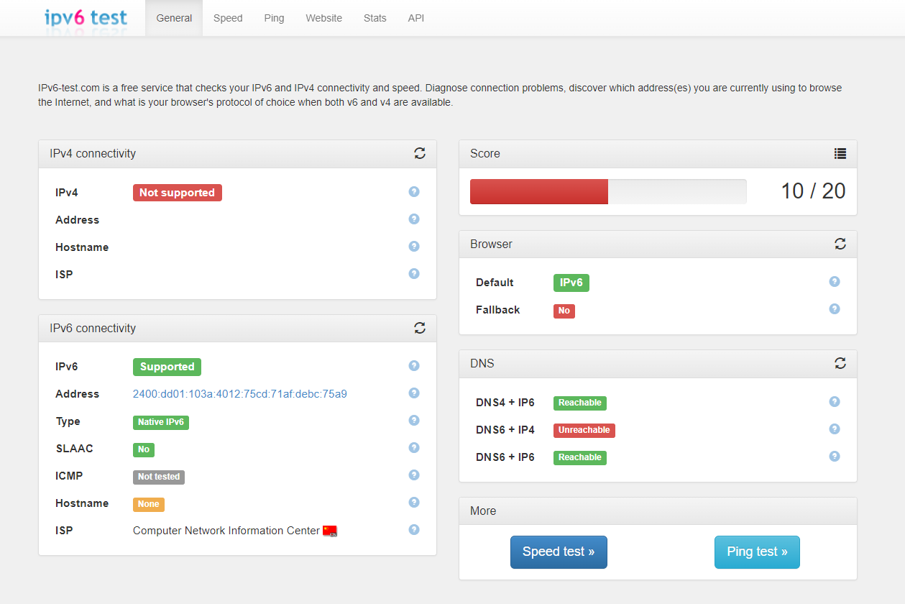

# 使用IPv6连接代理服务器，转发IPv4请求，绕过IPv4封锁

原作者： Tremb1e

修改和更新：YuSitong1999

## 大致步骤

    1.购买有IPv6和IPv4地址的服务器（众所周知如果在境外就更好了）
    2.在服务器上部署服务端ssr或类似的代理服务
    3.配置本地电脑上的客户端ssr或类似的连接代理服务器的软件，配置依赖IPv4的桌面应用程序

## 原理解释

当IPv4被屏蔽/限流，但同时IPv6没有时， 我们可以通过IPv6连接到另外一台既有IPv4也有IPv6的服务器上，

我们所有的访问请求（至少是IPv4的访问请求）都通过IPv6先发给远端服务器， 它执行IPv4或IPv6请求后，再将请求结果通过IPv6的方式转发给本机，

这样，本机对外只用了没被屏蔽/限流的IPv6。

## 环境测试（网络环境必须满足该条件）

### 电脑支持且已打开IPv6

当尚未突破IPv4封锁时，打开[https://IPv6-test.com/](https://IPv6-test.com/)

需要有IPv6信息，从而能通过IPv6代理转发IPv4请求。 （注：一般应该无IPv4信息，否则就可以直接连IPv4，没必要多此一举）



***

## 第一步.注册账户和购买服务器（需有IPv4 IPv6地址）

### 1.注册Vultr账号

这里推荐使用[Vultr（点击跳转注册页）](https://www.vultr.com/?ref=8506094)


推荐原因：

搭建此类服务器容易被封IP或者端口，Vultr按小时计费不会浪费，很容易通过删除和重新新建服务器来更换ip地址。

起价相对国外同类产品便宜

### 2.激活账户并充值

#### 支付方式

可以选Other，自定义充值金额（有下限）

Alipay（支付宝）和Crypto（加密货币）每次最少充值$10（10美元）

Credit Card（信用卡）和Paypal每次最少充值$1

**如果用信用卡或Paypal（可绑定国内银行卡）支付，可以通过 [这个链接](https://www.vultr.com/?ref=9071771-8H) 注册，可以得到$100用来测试，14天内有效**

#### 价格

多数地方价格最低5美元一个月，

美国有两个地方限量3.5美元一个月，可能延时比较大

2.5美元一个月只有IPv6地址没有IPv4地址，似乎在这儿用不了？

#### 建议

计算时间充值（短期内可退款），和朋友一起用性价比高


### 3.购买服务器

购买服务器有以下几个原则

- 所在地理位置一般与本机机器越近越好
- 在够用的基础上配置越低越好（512M内存就够用了）
- 操作系统尽可能选择自己熟悉的
- 建议用Linux，因为Windows往往要额外收费

（1）服务器类型选择Cloud Compute（注：因为起价最低）


(2)服务器地址推荐最近的亚洲新加坡


（3）镜像推荐自己习惯的发行版本，下文环境均以Ubuntu为例开发

（注：也可以选CentOS。特别是CentOS 7 x64 Without SELinux，后面就不用打开端口了）


（4）服务器大小，选最小的即可

这里对参数进行解释

- 25 GB SSD：硬盘为25G的SSD固态
- $5/month & $0.007/hour：Vultr按小时计费，每小时0.007刀，一个月费用为5美刀 （关机也收费，销毁才不收费）
- 1 CPU：1个CPU
- 1 GB memory：1G运行内存
- 1 TB Bandwidth：千兆带宽（这个配置的流量是一月1000G）


（5）**配置勾选IPv6（重要！！！这样才有IPv6地址）**


（6）点击创建服务器


## 第二步.连接和配置服务器

### 1.检测服务器是否可访问（注：可选，因为IP可能是别人被封IP后换下来的，导致连不上）

端口扫描网站：[http://coolaf.com/tool/port](http://coolaf.com/tool/port)

- 第一行填入服务器IP地址
- 第二行填入“22”（22端口为默认的SSH登录端口）
- 结果显示开放即表明服务器可以访问


### 2.安装服务端ssr

使用xshell、termius等工具连接至服务器（注：electerm也不错）


执行以下代码，获取和运行服务端ssr配置脚本

注：建议服务器可连接后等几分钟在执行，否则可能仍在执行部署过程，有程序在安装，导致yum lock被占用

```
wget -N --no-check-certificate https://raw.githubusercontent.com/ToyoDAdoubi/doubi/master/ssr.sh && chmod +x ssr.sh && bash ssr.sh
```

结果如图


依次选择：

- 1：选择安装ssr
- 6000：端口设置为6000 （注：可以修改，太小可能和已占用端口冲突）
- IPv6Wi-Fi：密码设置为IPv6Wi-Fi （注：可以修改，建议复杂一些）
- 10：加密方式选择为aes-256-cfb
- 2：协议选择为auth-sha1-v4
- y：兼容原版
- 5：混淆选择为tls1.2_ticket_auth
- y:兼容原版
- 三个回车，表示不做限制

之后就会开始安装ssr，结果如图所示


也可对ssr进行加速优化，如：安装BBR加速。不安装也不影响使用，此处不做讲解，请自行了解。

### 3.设置防火墙（注：如果选CentOS Without SELinux，应该不需要设置）

[https://my.vultr.com/firewall/](https://my.vultr.com/firewall/)

在防火墙设置中

这个是对IPv4防火墙tcp协议进行配置


这个是对IPv4防火墙udp协议进行配置


再对IPv6的TCP和UDP进行配置即可

## 第三步.配置本地电脑（windows环境，linux和mac也是可以用的，配置方法请自行寻找）

### 1.下载客户端ssr

### [ssr下载地址](https://github.com/shadowsocksrr/shadowsocksr-csharp/releases/download/4.9.0/ShadowsocksR-win-4.9.0.zip)

### 2.打开后对应栏目填写对应服务器端的信息


### 注意：这里的IP地址应填写服务器的IPv6地址


### 3.配置客户端ssr

右键点击右侧的小飞机

- 系统代理规则：全局模式
- 代理规则：绕过局域网（因为不论是不是大陆都需要绕过IPv4封锁）
- 如果只有一个服务器，不勾选服务器负载均衡

右键点击小飞机->选项设置 打开内网代理功能


### 4.软件配置使用代理

以微信为例（其他软件配置同理）


### 5.效果

退出IPv4登录后，百度、B站等网页也可以正常使用，如果服务器在境外可以使用谷歌。

**所有有地域限制的版权内容，将因代理服务器的所在地而受限**

**！在某些论坛发帖，或在新浪微博对某些微博发布评论，可能显示代理服务器的地址！**

未登录IPv6-test结果


未登录，代理后IPv6-test结果


