# 搭建服务器实现UCAS校园网免登陆使用教程 By Tremb1e

## 大致步骤
    1.购买一台境外服务器（需有IPV6地址，这点非常重要）
    2.在服务器上部署ssr或类似的服务
    3.配置本地电脑
    4.软件配置

## 原理解释

国科大开始对校园网进行限速
这里介绍一个可行的绕过校园网登录上网方案

首先，国科大校园网登录验证以及限速只是限制了ipv4的流量。
所以我们通过ipv6的连接方式，通过代理连接到另外一台既有v4也有v6的服务器上。
其次，我们所有的访问请求都通过v6转发给远端服务器，它再将v4或v6请求通过v6的方式转发给本机。
这样，本机对外只走了不需要验证也不收费的v6流量。而需要的v4请求由远端服务器完成，并转发给我们。

测试环境：国科大图书馆二楼机房
测试结果：未登录校园网账号，ipv6-test.com网站给出的v4和v6的ip均为远端服务器，且谷歌，B站等网站均能正常使用，速度接近500Mb/s。

## 环境测试（网络环境必须满足该条件）

### 电脑环境必须满足此条件，不然很可能使用失败（推荐有线网络）

未登录ucas校园网时，打开[https://ipv6-test.com/](https://ipv6-test.com/)

需要满足以下条件

- 无IPV4信息，即不登录校园网的情况下不支持IPV4网络
- 有IPV6信息，即不登录校园网的情况下也支持IPV6网络

只有满足该条件，才证明你的网络情况支持IPV6代理绕过校园网认证。


## 第一步.购买一台购买一台境外服务器（需有IPV6地址，这点非常重要）

### 1.注册[Vultr](https://www.vultr.com/?ref=7407281)账号

这里推荐使用[Vultr](https://www.vultr.com/?ref=7407281)。

链接：[https://www.vultr.com/?ref=7407281](https://www.vultr.com/?ref=7407281)


推荐原因：搭建此类服务器容易被封IP或者端口，Vultr删除和新建服务器比较容易且速度很快。

### 2.激活账户并充值

选择信用卡或者支付宝，充值10美刀即可。（价格是一月是5美刀，计算时间充值（短期内可退款），和朋友一起用性价比高）

最低充值10美刀，然后扫码付款即可。

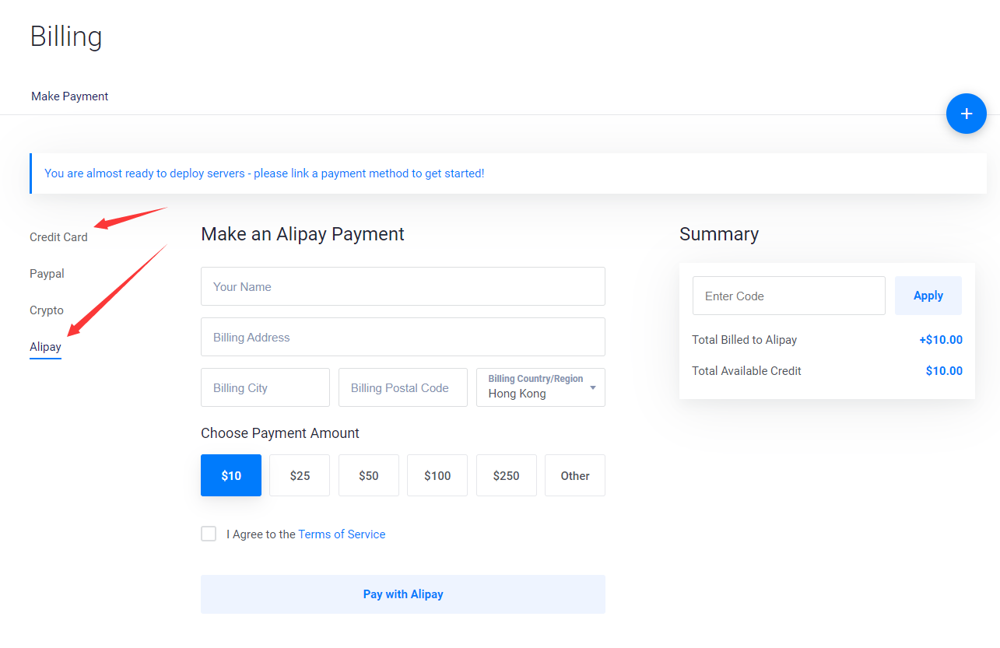

### 3.购买服务器
购买服务器有以下几个原则

- 物理上与本机机器越近越好
- 在够用的基础上配置越低越好（512M内存就够用了）
- 操作系统尽可能选择自己熟悉的

（1）服务器类型选择Cloud Compute

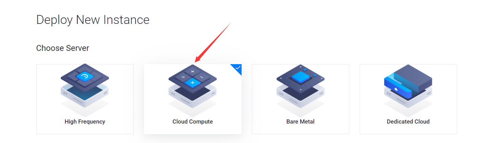

(2)服务器地址推荐最近的亚洲新加坡

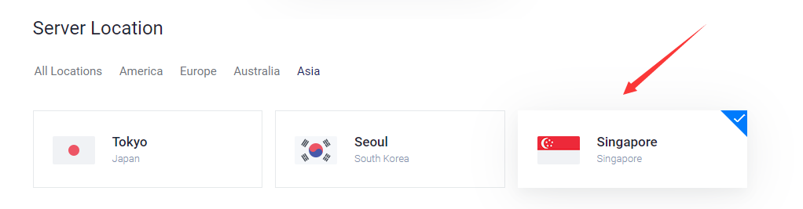

（3）镜像选择Ubuntu

#### 镜像推荐自己习惯的发行版本，下文环境均以Ubuntu为例开发，若不知如何选择，选Ubuntu即可

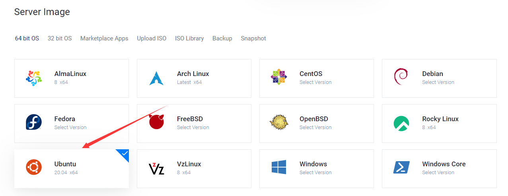

（4）服务器大小，选最小的即可

这里对参数进行解释

- 25 SSD：硬盘为25G的SSD固态
- $5/month & $0.007/hour：Vultr按小时计费，每小时0.007刀，一个月费用为5美刀（关机也收费，销毁才不收费）
- 1 CPU：1个CPU
- 1 GB memory：1G运行内存
- 1 TB Bandwidth：千兆带宽（这个配置的流量是一月1000G）

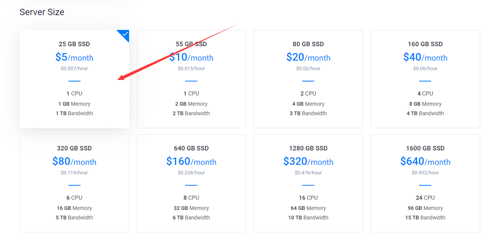

（5）配置勾选IPV6（重要！！！）

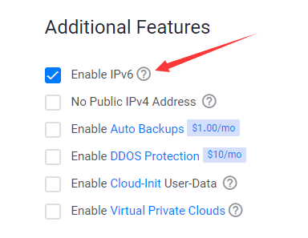

（6）点击创建服务器

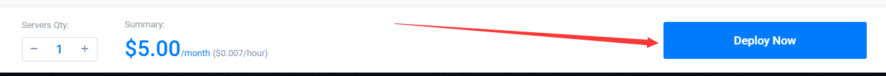

## 第二步.配置服务器

### 1.检测服务器是否存活

端口扫描网站：[http://coolaf.com/tool/port](http://coolaf.com/tool/port)

- 第一行填入服务器IP地址
- 第二行填入“22”（22端口为默认的SSH登录端口）
- 结果显示开放即表明服务器存活

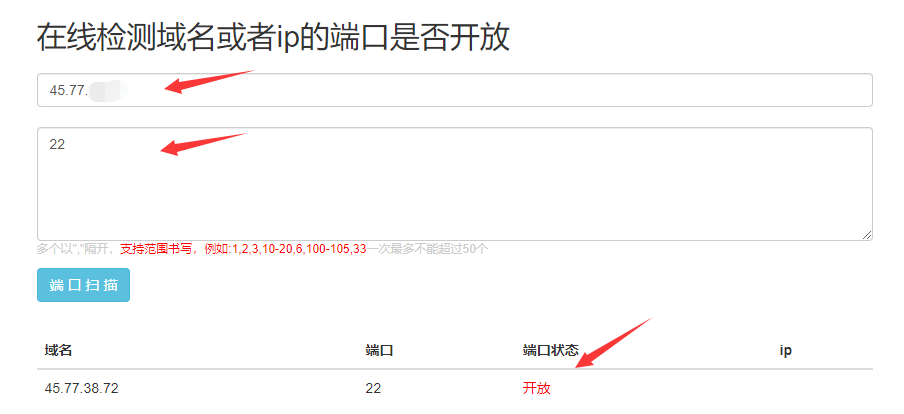

### 2.安装ssr

使用xshell、termius等工具连接至服务器


执行以下代码

```
wget -N --no-check-certificate https://raw.githubusercontent.com/ToyoDAdoubi/doubi/master/ssr.sh && chmod +x ssr.sh && bash ssr.sh
```
结果如图


依次选择：
- 1：选择安装ssr
- 6000：端口设置为6000
- 123456：密码设置为123456  //可随意修改
- 10：加密方式选择为aes-256-cfb
- 2：协议选择为auth-sha1-v4
- y：兼容原版
- 5：混淆选择为tls1.2_ticket_auth
- y:兼容原版
- 三个回车，表示不做限制

之后就会开始安装ssr，结果如图所示

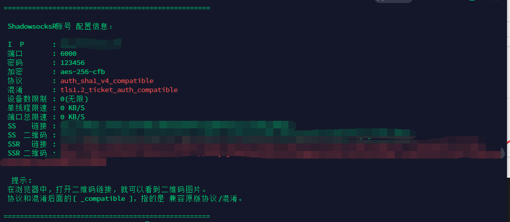

也可对ssr进行加速优化，如：安装BBR加速。不安装也不影响使用，此处不做讲解，请自行了解。

### 3.设置防火墙

[https://my.vultr.com/firewall/](https://my.vultr.com/firewall/)

在防火墙设置中

这个是对IPV4防火墙tcp协议进行配置

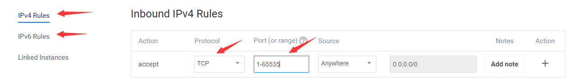

这个是对IPV4防火墙udp协议进行配置

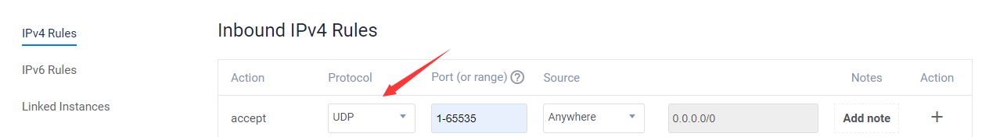

再对IPV6的TCP和UDP进行配置即可

## 第三步.配置本地电脑（windows环境，linux和mac也是可以用的，配置方法请自行寻找）

### 1.下载ssr

### [ssr下载地址](https://github.com/shadowsocksrr/shadowsocksr-csharp/releases/download/4.9.0/ShadowsocksR-win-4.9.0.zip)

### 2.打开后对应栏目填写对应服务器端的信息

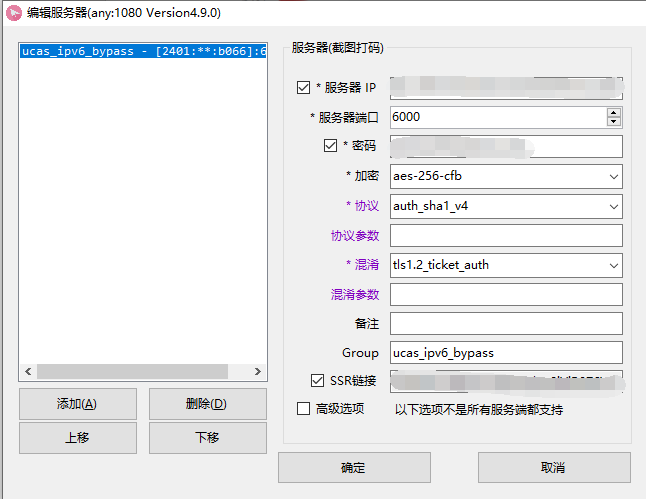

### 注意：这里的IP地址应填写服务器的IPV6地址

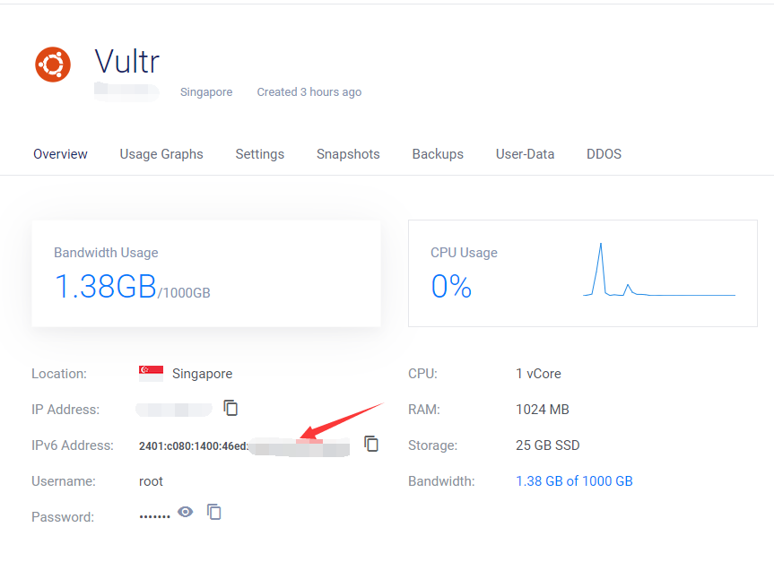

### 3.配置ssr

右键点击右侧的小飞机

- 系统代理规则：全局模式
- 代理规则：绕过局域网
- 不勾选服务器负载均衡


右键点击小飞机->选项设置  打开内网代理功能

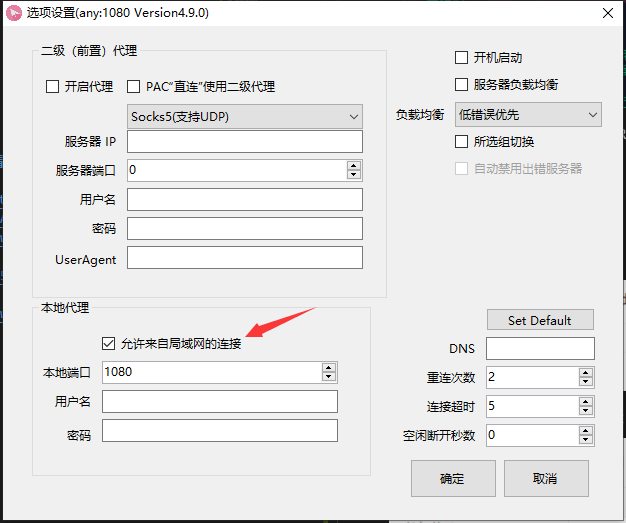

### 自此，退出校园网登录后，谷歌、B站等网页也可以正常使用

### 此时打开[https://ipv6-test.com/](https://ipv6-test.com/)，应该显示为下图情况

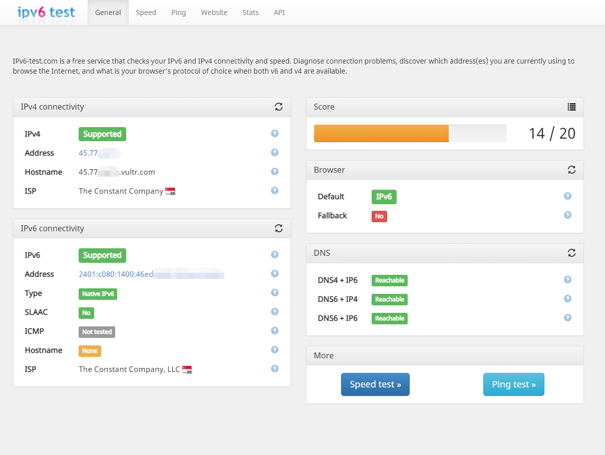

## 第四步.软件配置

软件如何使用代理

以微信为例（其他软件配置同理）

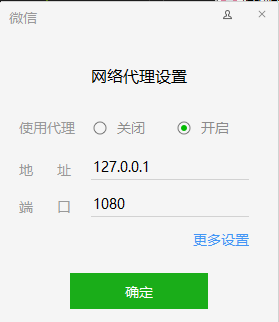

## 第五步.效果测评

校园网未登录ipv6-test结果


校园网未登录，代理后ipv6-test结果


代理后裸连测速，结果接近500Mb/s

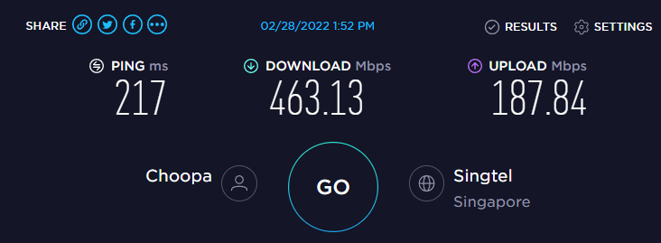

